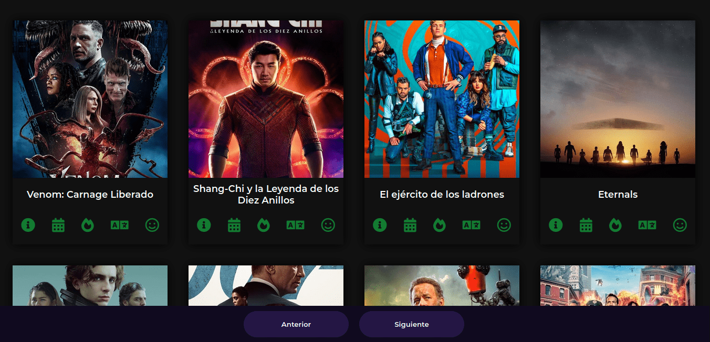

# [Como Conectarse a una API con Javascript usando Async, Await y Fetch](https://youtu.be/PNr8-JDMinU "Tutorial")

 

 

### Por: [FalconMasters](http://www.falconmasters.com "Falcon Masters web")

 

## Aclaración

**Por políticas `CORS`, este ejemplo solo funciona mediante el uso del [`LIVE SERVER`](https://marketplace.visualstudio.com/items?itemName=ritwickdey.LiveServer "Live Server") por el momento.**

## Screenshots

 

